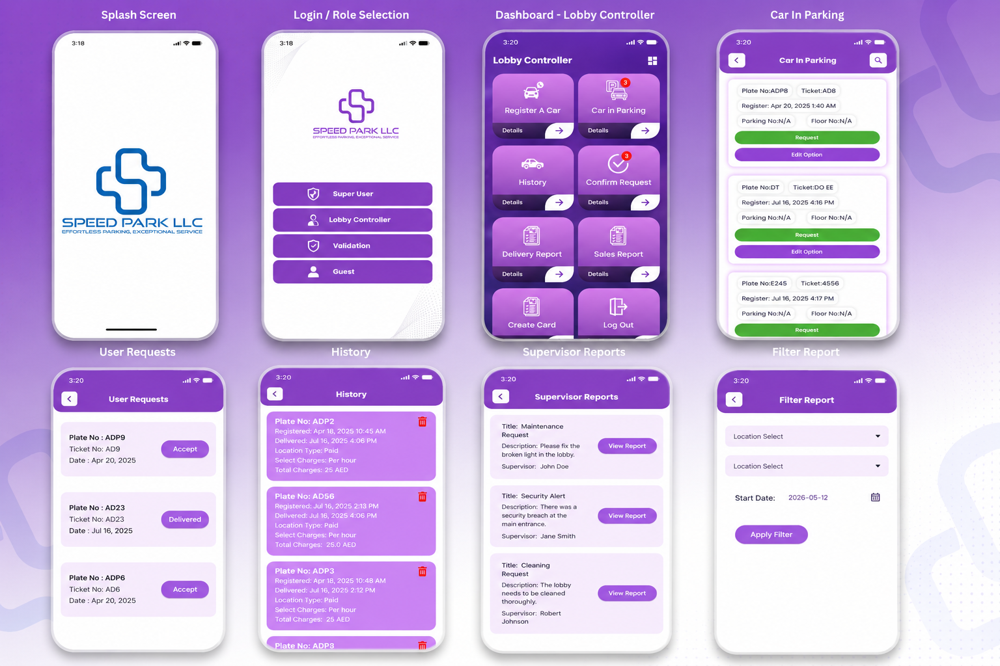
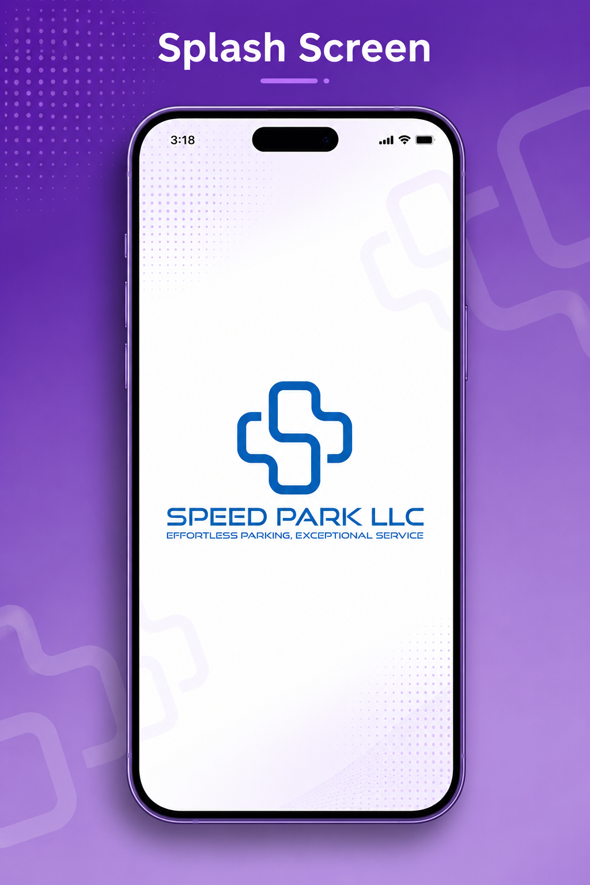
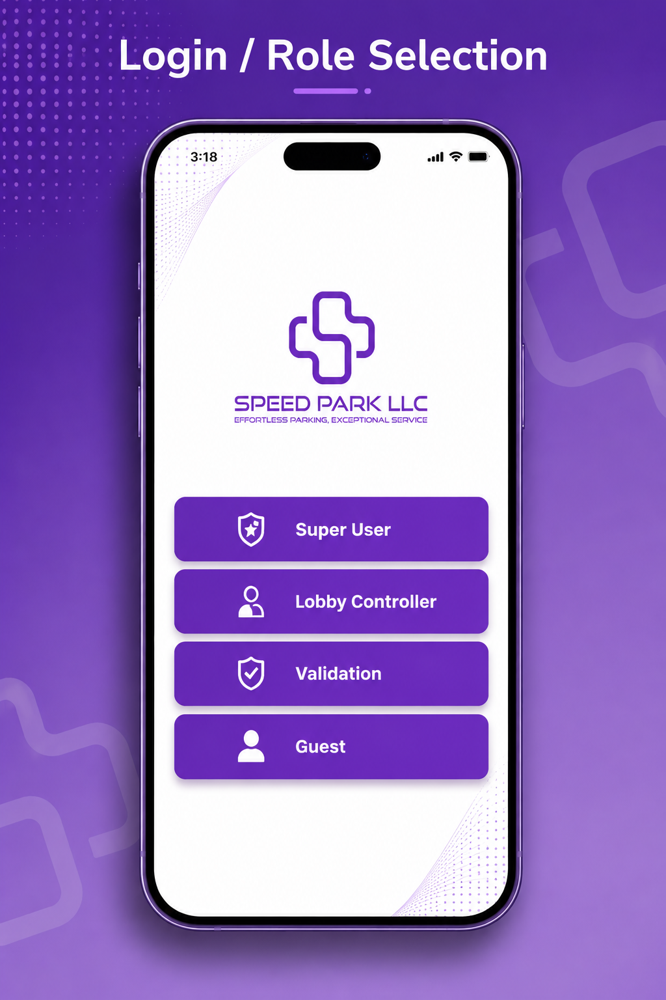
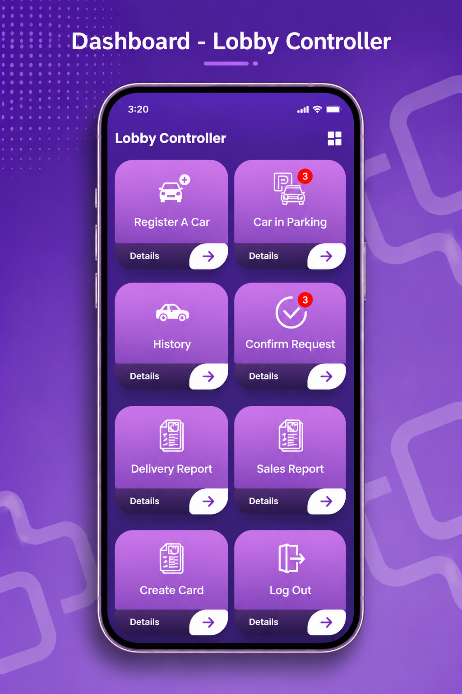
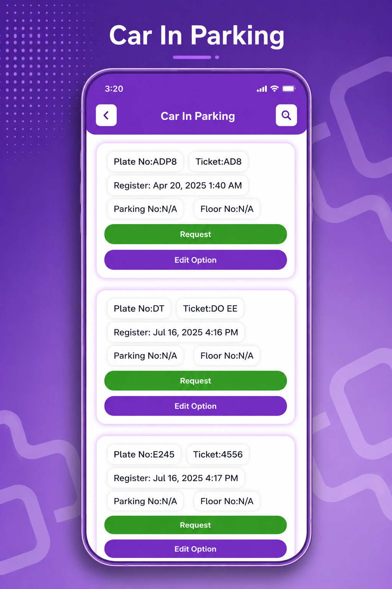
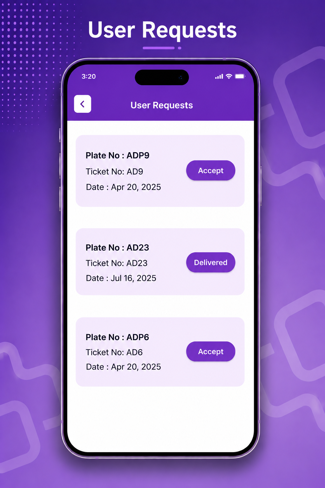
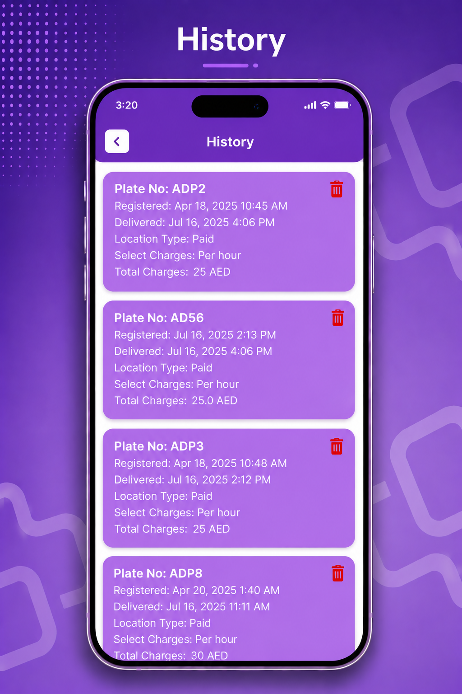
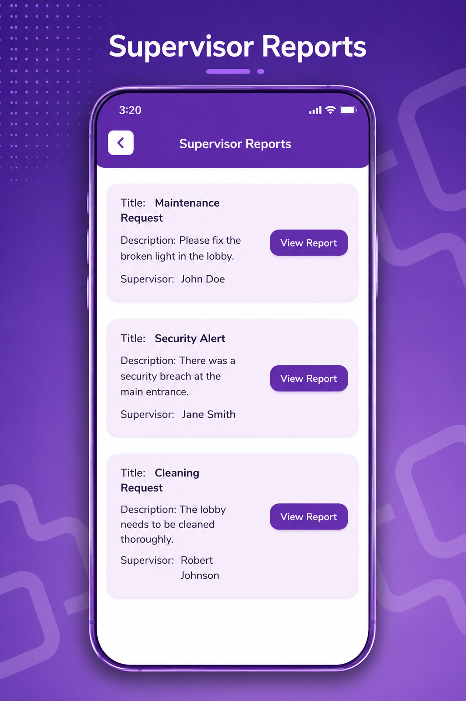
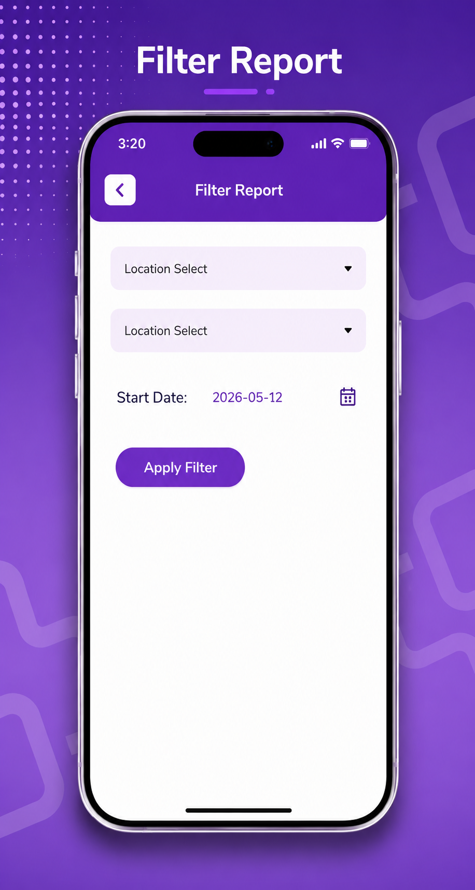

# 🚗 SPEED PARK LLC

A modern **Flutter-based Smart Parking Management App** designed for parking controllers, supervisors, and validation teams.  
This system helps manage vehicle parking operations efficiently with role-based access and real-time parking records.

---

## 📱 App Screenshots
Main Page 



| Splash Screen | Login / Role Selection | Dashboard |
|--------------|------------------------|-----------|
|  |  |  |

| Car In Parking | User Requests | History |
|---------------|--------------|---------|
|  |  |  |

| Supervisor Reports | Filter Report |
|-------------------|--------------|
|  |  |

---

## ✨ Features

### 👤 Role Based Login
- Super User  
- Lobby Controller  
- Validation  
- Guest  

### 🚘 Parking Management
- Register a car  
- Car in parking records  
- Request vehicle retrieval  
- Confirm requests  

### 📊 Reports & History
- Delivery reports  
- Sales reports  
- Vehicle history logs  
- Filter reports by date/location  

### 🔐 Secure & Fast
- Firebase Authentication  
- Firestore Database  

---

## 🛠 Tech Stack

- **Flutter**
- **Dart**
- **Firebase Auth**
- **Cloud Firestore**
- **Getx State Management**

---

## 📂 Project Structure

```bash
lib/
 ┣ core/
 ┣ ui/
 ┣ widgets/
